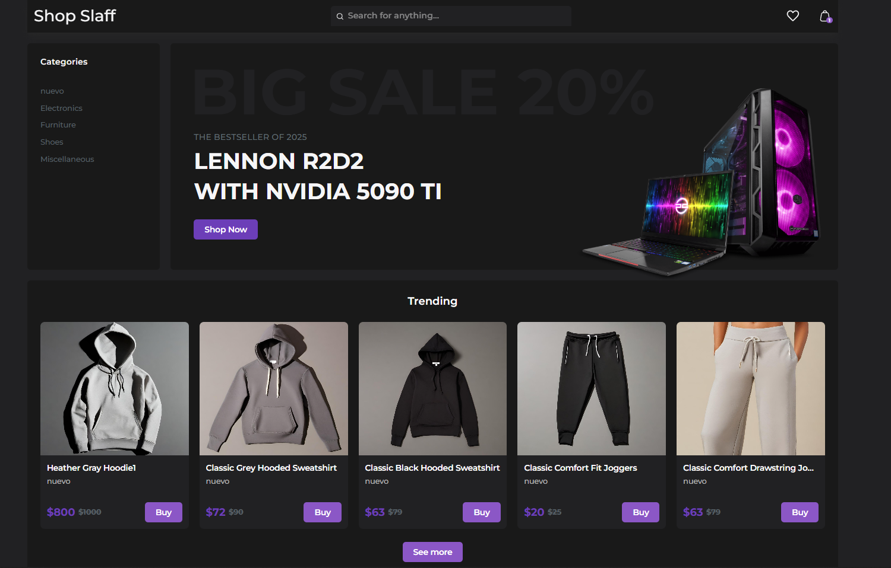
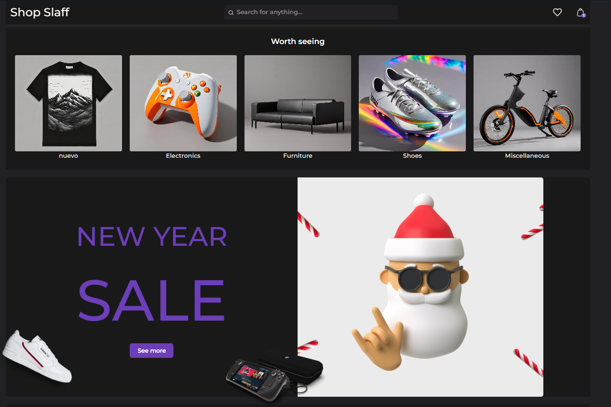
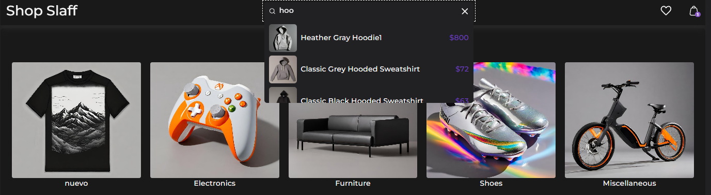
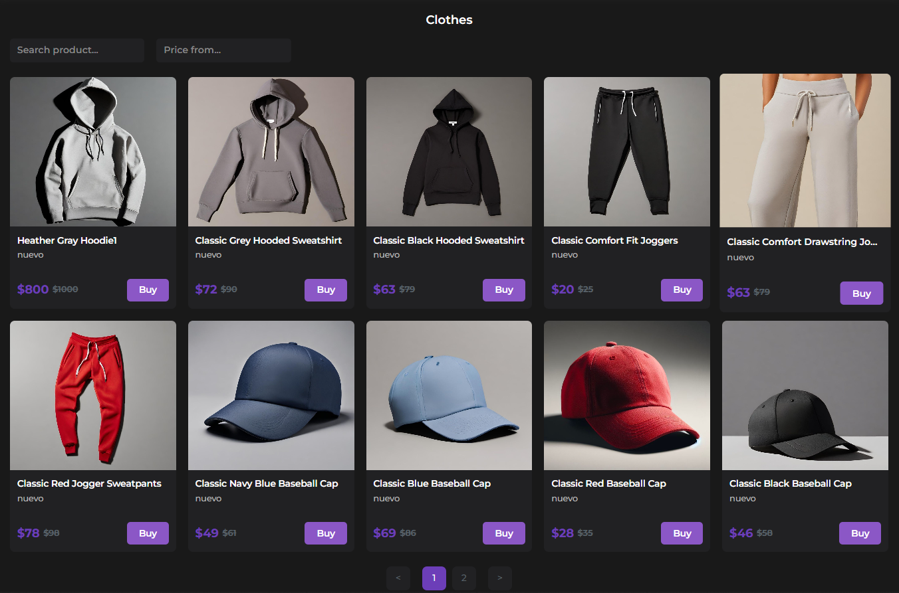
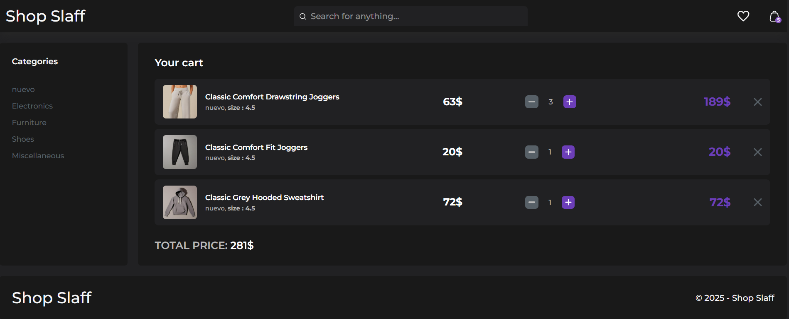
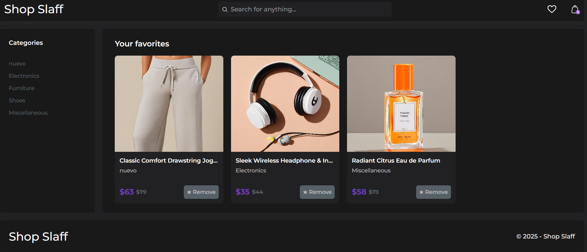
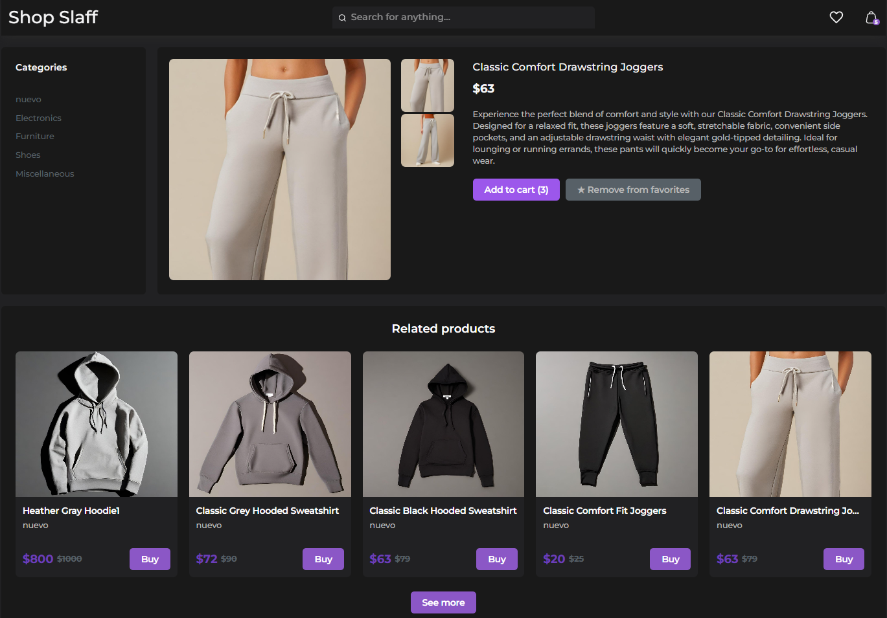

# ShopSlaff 🌐

## Previews:

## Welcome! 👋

Challenge is to build out this ShopSlaff website.

This project was created using React, tailwindCSS, Vite, Redux Toolkit, TypeScript, React-router-dom.

Link to see the result: [ShopSlaff](shop-slaff.vercel.app)

## Getting Started 🚀

Run the development server:
1. npm run dev
2. Open [http://localhost:5173](http://localhost:5173) with your browser to see the result.
